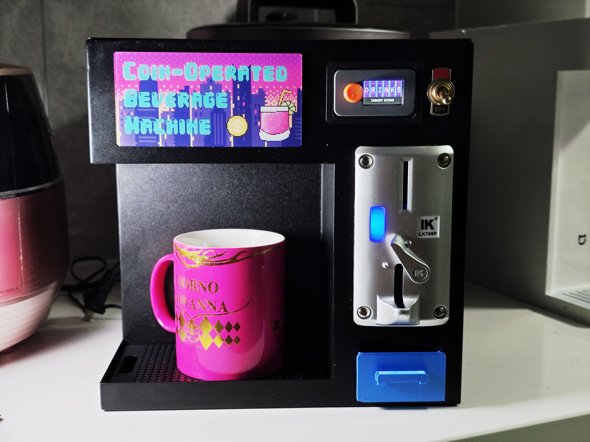

# micropython-Coin-Operated-Beverage-Machine



## Project Overview

This is a coin-operated beverage machine project that combines fun and practicality, with the **M5Stack DinMeter** as the core controller. It enables precise control of the water output through the DinMeter knob. The system integrates a coin acceptor, water pump, toggle switch, relay, and other components, all housed in a custom-made black metal case with a strong industrial aesthetic.

The operation is straightforward: insert a coin → rotate the DinMeter to adjust the flow → press the switch to dispense the drink. Every interaction brings a sense of fun, making it not only a functional beverage dispenser but also an eye-catching “atmosphere device.”

It’s suitable for bars, parties, exhibitions, maker spaces, and other venues—adding a unique touch of technology and creativity to the environment. This project is more than just a device; it’s a playful fusion of people, technology, and imagination.


## Getting Started

### 1.Clone the Repository

```
git clone https://github.com/jd3096-mpy/micropython-Coin-Operated-Beverage-Machine.git
cd micropython-Coin-Operated-Beverage-Machine
```

### 2. Flash the Firmware to ESP32

Flash `firmware.bin` to your ESP32 using your preferred flashing tool (e.g., `esptool.py`, `Flash Download Tool`, etc.).

### 3. Upload the Source Code

Use **Thonny** (or any MicroPython IDE) to upload all the files in the `src` folder to the ESP32.


## Demo Video

[▶️ Watch on YouTube](https://youtu.be/p3J-5d9zr7I)

